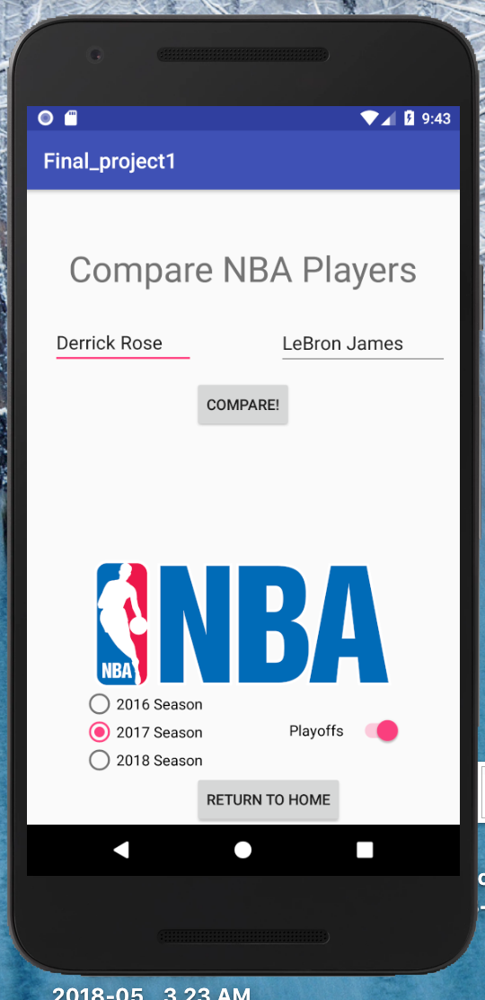
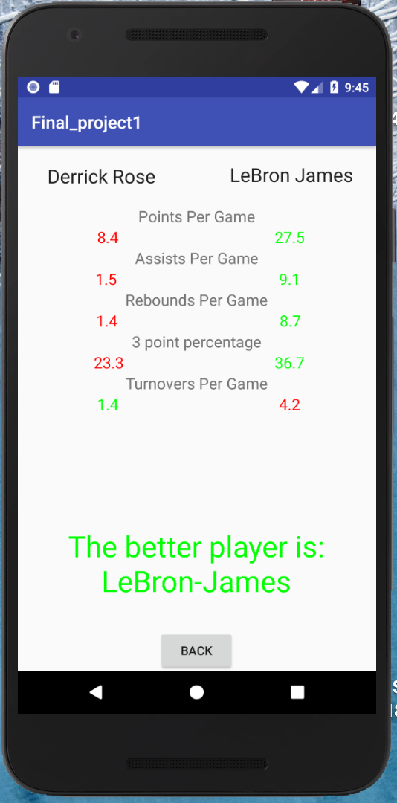

# Athlete Analyzer
This is a Java based Android Application focused on utilizing Web-API's in order to enhance our overall product.
 
It is currently designed to pick the "better" player out of two from the NBA, NFL and MLB, based on a few hand picked stats.
 
 
 

  This screen is the home screen where the user can click one of the three leagues to pick players to compare.
   
 
  
  

I used a sports API which provided me with data for specific players based on which player and which league he was in.
The Data class includes the API call method which provides the rest of the program a JSON to work with.
The MLB, NFL and NBA classes each have methods which parse the JSON and return specific stats used to compare players.
 
 
 

    The second activity is the screen where the user can enter the two players they wish to compare. The textfields auto-complete as the user begins to type the players' name. 
   
   
  
  

 
 
 
     
                                                                                      
   The final page of the app is where the stats used in the analysis will be displayed. Based on the analysis the name of the better player will be displayed at the bottom of the screen.                                                                                  
      
                                                         
  
  

 
 
 
Currently I am working on improving the analysis of the two players using advanced stats and a more refined algorithm to determine the superior players.
